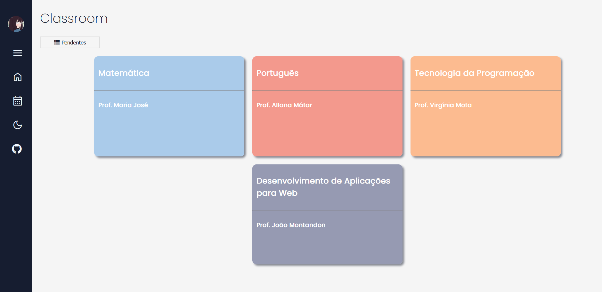
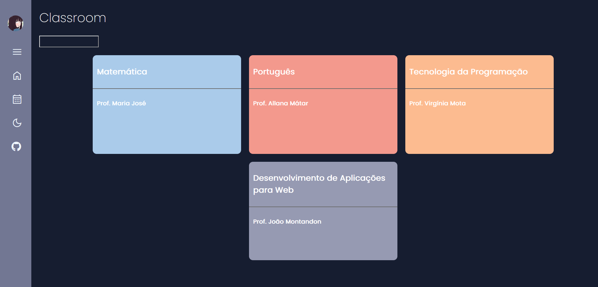

# Classroom versão brasileira
Neste trabalho, feito em grupo com @vithono, @juliaaliceleao, @AnnyACAM e @beacms, treinamos nossas habilidade em HTML, CSS e JS. O projeto é no estilo Google Sala de aula e possui modo claro e noturno.

 
  

